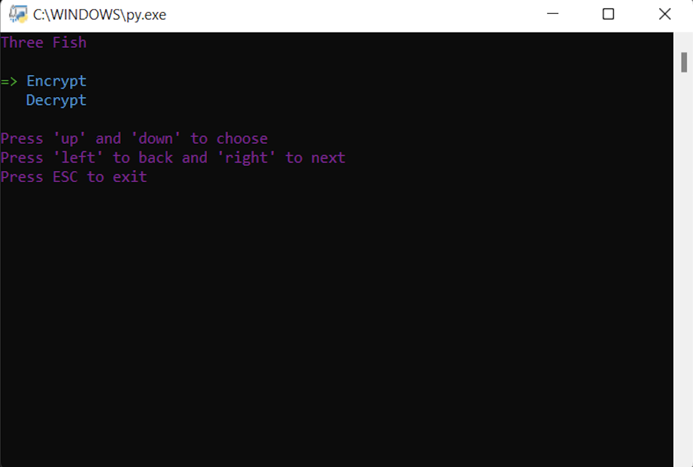

# Threefish algorithm

The implementation of [ThreeFish](https://github.com/katus-ngo/threefish-algorithm/blob/main/fish.py) in python

## Environement

```
Python3.6.3 + Any(windows, darwin, linux)
```

## Installation

```bash
git clone https://github.com/katus-ngo/threefish-algorithm.git
cd threefish-algorithm
pip3 install -r requirements.txt
```

## Utilisation

```
cd threefish-algorithm
sudo ./cmd.py
```

## Demo


